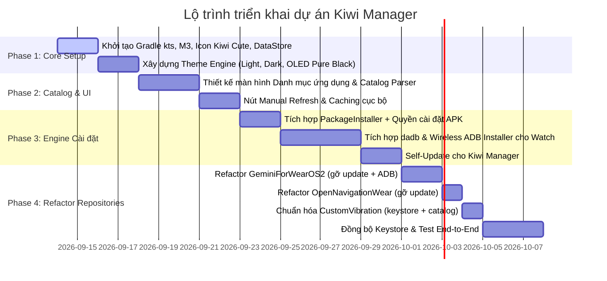

# KIWI MANAGER - TÀI LIỆU ĐẶC TẢ YÊU CẦU DỰ ÁN (PROJECT REQUIREMENTS)

> **Dự án:** Kiwi Manager & Hệ sinh thái ứng dụng Wear OS  
> **Repository:** [KiwiManager](https://github.com/quyetbkhoa/KiwiManager.git)  
> **Phiên bản tài liệu:** 1.1.0  
> **Trạng thái:** Đã phê duyệt (Approved)

---

## 1. TỔNG QUAN DỰ ÁN (PROJECT OVERVIEW)

### 1.1. Mục tiêu & Tầm nhìn
**Kiwi Manager** là ứng dụng trung tâm (Centralized App Hub & Manager) chạy trên nền tảng Android (điện thoại), lấy cảm hứng từ mô hình của **Vanced / ReVanced Manager** và **Morphe**. Ứng dụng đóng vai trò như một kho ứng dụng kiêm công cụ quản lý cài đặt / cập nhật tập trung cho toàn bộ hệ sinh thái ứng dụng cá nhân trên **Điện thoại (Phone Companion)** và **Đồng hồ thông minh (Wear OS)**.

Thay vì mỗi ứng dụng vệ tinh phải tự tích hợp module cập nhật, kiểm tra phiên bản GitHub rườm rà và các màn hình ADB phức tạp, **Kiwi Manager** sẽ gộp toàn bộ các tác vụ này về một mối:
1. Quản lý danh mục ứng dụng Wear OS và Phone Companion.
2. Kiểm tra phiên bản hiện tại trên điện thoại và đồng hồ so với bản phát hành mới nhất.
3. Cài đặt trực tiếp file APK lên điện thoại thông qua trình cài đặt chuẩn của Android (`PackageInstaller`).
4. Cài đặt file APK lên đồng hồ qua kết nối không dây **Wireless ADB** (`dadb`) mà không cần máy tính.
5. Tự kiểm tra và tự cập nhật cho chính mình (**Self-Update**).
6. Cung cấp nút làm mới kho ứng dụng thủ công (**Manual Repository Refresh**).

### 1.2. Nhận diện thương hiệu & Thiết kế (Branding & Mascot)
- **Tên thương hiệu:** Kiwi Manager
- **Mascot & Icon:** Quả Kiwi dễ thương (Cute chibi kiwi fruit: thân tròn lông mịn màu nâu nhạt, mắt to tròn long lanh, một nửa bổ đôi lộ phần ruột xanh kiwi tươi mọng và hạt đen ngộ nghĩnh).
- **Màu sắc chủ đạo:**
  - *Kiwi Fresh Green:* `#66BB2B` / `#8EE53F` (Primary Accent)
  - *Kiwi Brown:* `#795548` / `#5D4037` (Secondary Accent)
  - *M3 Surface & Backgrounds:* Tương thích hoàn hảo với Material Design 3.

### 1.3. Hệ sinh thái ứng dụng vệ tinh (Satellite Apps)

| App | Kiến trúc | Phone Package | Watch Package | Trạng thái hiện tại |
|-----|-----------|--------------|---------------|---------------------|
| **Gemini for Wear OS** | Dual-module (`phone/` + `watch/`) | `com.oppowatch.gemini` | `com.oppowatch.gemini` | Có `GitHubUpdateManager` + dadb → cần gỡ bỏ |
| **Open Navigation Wear** | Dual-module (`phone/` + `watch/`) | `com.opennavigation.wear` | `com.opennavigation.wear` | Có `GitHubUpdateManager` → cần gỡ bỏ |
| **Custom Vibration** | **Watch-only** (chỉ module `app/`) | *(không có)* | `com.oppowatch.haptics` | Không có update engine, chưa có keystore |

> **Lưu ý:** Custom Vibration là ứng dụng **chỉ chạy trên Wear OS**, không có Phone Companion. Trong `catalog.json` field `phone` sẽ là `null`. Việc refactor cho app này chỉ cần: tạo keystore + thêm signingConfig + đăng ký vào catalog.

---

## 2. NỀN TẢNG CÔNG NGHỆ & NGUYÊN TẮC KIẾN TRÚC

### 2.1. Tech Stack
- **Ngôn ngữ:** 100% Kotlin hiện đại (Coroutines, Flow, StateFlow).
- **Giao diện:** Jetpack Compose (Declarative UI) hoàn toàn, không dùng XML layout truyền thống.
- **Hệ thống thiết kế:** Material Design 3 (Material You / M3 Components).
- **Kết nối Wireless ADB:** Thư viện `dev.mobile:dadb:1.2.6` (thuần Kotlin/Java ADB client chạy trực tiếp trên Android).
- **Lưu trữ cục bộ:** Jetpack DataStore Preferences (lưu cài đặt theme, danh sách IP đồng hồ đã kết nối, cấu hình cache).
- **Mạng & Tải file:** OkHttp / Ktor Client hỗ trợ streaming download với bộ đếm tiến trình (% và MB/s).
- **Serialization:** Kotlin Serialization (`kotlinx.serialization`) để parse `catalog.json`.

### 2.2. Nguyên tắc kiến trúc (Modern Android Architecture)
Dự án áp dụng chặt chẽ kiến trúc **Clean Architecture** kết hợp mô hình luồng dữ liệu một chiều **UDF (Unidirectional Data Flow)**:
```
┌─────────────────────────────────────────────────────────┐
│                      UI LAYER                           │
│  Compose Screens ◄── StateFlow (UiState) ── ViewModels  │
│  User Interactions ── (UiEvent) ───────────► ViewModels │
└────────────────────────────┬────────────────────────────┘
                             │ invokes
┌────────────────────────────▼────────────────────────────┐
│                    DOMAIN LAYER                         │
│  UseCases:                                              │
│  - GetAppCatalogUseCase                                 │
│  - CheckVersionUseCase (Phone & Watch)                  │
│  - DownloadApkUseCase                                   │
│  - InstallPhoneApkUseCase                               │
│  - InstallWatchApkViaAdbUseCase                         │
│  - ConnectWatchAdbUseCase                               │
└────────────────────────────┬────────────────────────────┘
                             │ calls
┌────────────────────────────▼────────────────────────────┐
│                     DATA LAYER                          │
│  - Repository Implementations                           │
│  - Remote Data Sources (GitHub API / Raw Catalog JSON)  │
│  - Local Data Sources (DataStore, PackageManager)       │
│  - Wireless ADB Engine (dadb instance manager)          │
└─────────────────────────────────────────────────────────┘
```

### 2.3. Cấu trúc thư mục dự kiến (Project Structure)
```
app/src/main/java/com/kiwi/manager/
├── KiwiManagerApp.kt              # Application class
├── MainActivity.kt                # Single Activity entry point
├── ui/
│   ├── theme/
│   │   ├── Color.kt               # Bảng màu Kiwi (Light, Dark, OLED)
│   │   ├── Type.kt                # Typography
│   │   └── Theme.kt               # KiwiManagerTheme composable
│   ├── navigation/
│   │   └── KiwiNavGraph.kt        # Navigation Compose
│   ├── screen/
│   │   ├── home/                   # Màn hình danh sách app (HomeScreen + ViewModel)
│   │   ├── appdetail/              # Chi tiết app + nút cài đặt
│   │   ├── adbconnect/             # Hướng dẫn kết nối ADB
│   │   └── settings/               # Cài đặt Theme, IP History
│   └── component/                  # Reusable UI components (AppCard, StatusBadge...)
├── domain/
│   ├── model/                      # AppInfo, VersionInfo, AdbDevice, InstallResult...
│   └── usecase/                    # Business logic use cases
├── data/
│   ├── repository/                 # CatalogRepository, AdbRepository, DownloadRepository
│   ├── remote/                     # GitHubApiService, CatalogJsonParser
│   └── local/                      # DataStoreManager, PackageManagerWrapper
└── util/                           # Extension functions, Constants, VersionComparator
```

### 2.4. Hệ thống Theme (Dynamic Theme Engine - 3 Chế độ)
Ứng dụng hỗ trợ 3 theme có thể chuyển đổi tức thì trong phần Cài đặt và được lưu cố định vào DataStore:
1. **Light Theme (Sáng thanh lịch):** Nền trắng kem sáng dịu (`#FBFDF8`), thẻ bài màu trắng sạch sẽ, viền xanh kiwi tươi.
2. **Dark Theme (Tối tiêu chuẩn):** Nền xám đen hiện đại (`#1A1C18`), bề mặt thẻ `#232620`, độ tương phản dịu mắt ban đêm.
3. **Pure OLED Black (Đen tuyệt đối):** Nền đen tuyền hoàn toàn (`#000000`), thẻ màu xám đậm tối giản hoặc viền xanh kiwi mảnh, tắt hoàn toàn điểm ảnh trên màn hình AMOLED giúp tiết kiệm pin tối đa cho điện thoại và đồng bộ với màn hình Wear OS.

### 2.5. Quyền Android bắt buộc (Required Permissions)
```xml
<!-- Mạng & Tải file -->
<uses-permission android:name="android.permission.INTERNET" />
<uses-permission android:name="android.permission.ACCESS_NETWORK_STATE" />
<uses-permission android:name="android.permission.ACCESS_WIFI_STATE" />

<!-- Cài đặt APK từ nguồn bên ngoài (Android 8.0+) -->
<uses-permission android:name="android.permission.REQUEST_INSTALL_PACKAGES" />

<!-- Download dài trong nền -->
<uses-permission android:name="android.permission.FOREGROUND_SERVICE" />
<uses-permission android:name="android.permission.FOREGROUND_SERVICE_DATA_SYNC" />

<!-- Thông báo tiến trình tải (Android 13+ / API 33+) -->
<uses-permission android:name="android.permission.POST_NOTIFICATIONS" />
```

> **Lưu ý quan trọng:** Trước khi cài APK lần đầu, ứng dụng phải kiểm tra `packageManager.canRequestPackageInstalls()`. Nếu trả về `false`, hiển thị dialog hướng dẫn rõ ràng và mở `Settings.ACTION_MANAGE_UNKNOWN_APP_SOURCES` với URI của Kiwi Manager để người dùng cấp quyền.

---

## 3. HAI LUỒNG TRIỂN KHAI SONG SONG (TWO PARALLEL TRACKS)

### Track 1: Xây dựng ứng dụng Kiwi Manager
Xây dựng một ứng dụng Android hoàn chỉnh tại repository `KiwiManager` đáp ứng đầy đủ các tính năng quản lý, kết nối ADB và cập nhật.

### Track 2: Refactor các ứng dụng con trong hệ sinh thái
Tiến hành chuẩn hóa và tối giản hóa các repository ứng dụng hiện có:

**Nhiệm vụ cụ thể cho Track 2:**

#### GeminiForWearOS2 (Dual-module: phone + watch)
1. Gỡ bỏ `GitHubUpdateManager.kt` và toàn bộ UI tab ADB Update cồng kềnh trong `PhoneMainActivity`.
2. Gỡ bỏ dependency `dev.mobile:dadb` khỏi `phone/build.gradle.kts` (engine ADB sẽ nằm trong Kiwi Manager).
3. Thay thế bằng nút tinh gọn: *"Kiểm tra cập nhật qua Kiwi Manager"* (xem mục FR-6 Fallback).

#### OpenNavigationWear (Dual-module: phone + watch)
1. Gỡ bỏ `GitHubUpdateManager.kt` và UI cập nhật trong `PhoneMainActivity`.
2. Thay thế bằng nút tinh gọn mở Kiwi Manager (xem mục FR-6 Fallback).

#### CustomVibrationForWearOS2 (Watch-only)
1. **Tạo keystore mới** cho ứng dụng (hoặc dùng chung keystore hệ sinh thái).
2. **Thêm `signingConfig` release** vào `app/build.gradle.kts` (hiện đang thiếu hoàn toàn).
3. **Đăng ký vào catalog** — chỉ có field `watch`, không có `phone`.
4. *(Không cần gỡ GitHubUpdateManager vì app này chưa bao giờ có).*

#### Chuẩn hóa chung
- Chuẩn hóa chữ ký số (Keystore) giữa tất cả các ứng dụng để lệnh `pm install -r` không bị lỗi `INSTALL_FAILED_UPDATE_INCOMPATIBLE`.
- Đồng bộ cấu trúc phát hành Release trên GitHub theo quy chuẩn đặt tên file APK.

---

## 4. CHI TIẾT YÊU CẦU CHỨC NĂNG (FUNCTIONAL REQUIREMENTS)

### FR-1: Quản lý danh mục kho ứng dụng (Catalog & Repository Management)
- **FR-1.1:** Nạp danh mục ứng dụng từ nguồn online (file cấu hình `catalog.json` lưu trên GitHub raw hoặc GitHub Releases API).
- **FR-1.2:** Dữ liệu mỗi ứng dụng gồm:
  - `id`: Định danh duy nhất (ví dụ: `gemini_wear`).
  - `name`: Tên ứng dụng hiển thị (ví dụ: `Gemini for Wear OS`).
  - `description`: Mô tả ngắn gọn về tính năng.
  - `iconUrl`: Đường dẫn icon (hoặc icon nội bộ có sẵn).
  - `githubRepo`: Đường dẫn GitHub repository (ví dụ: `quyetbkhoa/GeminiForWearOS2`).
  - `source`: Chế độ lấy dữ liệu (`static` hoặc `github_releases`).
  - `phone`: Thông tin thành phần điện thoại *(có thể `null` cho app Watch-only)*:
    - `packageName`, `versionName`, `versionCode`, `downloadUrl`, `changelog`, `minSdk`, `assetPattern`.
  - `watch`: Thông tin thành phần đồng hồ *(có thể `null` cho app Phone-only)*:
    - `packageName`, `versionName`, `versionCode`, `downloadUrl`, `changelog`, `minSdk`, `assetPattern`.
- **FR-1.3 - Nút Cập nhật kho thủ công:** Cung cấp nút "Làm mới kho" trên Top App Bar và hỗ trợ cử chỉ kéo xuống (Pull-to-refresh) để ép tải lại danh mục ứng dụng từ server.
- **FR-1.4 - Cơ chế Caching:** Lưu cache danh mục vào bộ nhớ cục bộ để app vẫn hiển thị được danh sách ngay cả khi không có mạng. Hiển thị badge "Offline" khi không có kết nối.
- **FR-1.5 - Chế độ kép lấy dữ liệu catalog (Static vs Dynamic):**
  - **Static mode:** Đọc `versionName` + `downloadUrl` cố định từ JSON (phù hợp khi catalog được CI/CD tự động cập nhật).
  - **Dynamic mode (`source: "github_releases"`):** Chỉ cần `githubRepo` + `assetPattern` trong catalog, Kiwi Manager tự gọi GitHub Releases API để lấy phiên bản mới nhất → **Zero-maintenance**, không cần cập nhật JSON mỗi lần release.

> **Ghi chú quan trọng:** Phiên bản Phone và Watch của cùng một ứng dụng **hoàn toàn độc lập**. Phone có thể ở `v1.3.4` trong khi Watch ở `v1.4.0`. Kiwi Manager phải so sánh và cập nhật từng thành phần riêng biệt (tương tự field `needPhoneUpdate` / `needWatchUpdate` trong code hiện tại của OpenNavigationWear).

### FR-2: Tính năng tự cập nhật (Self-Update)
- **FR-2.1:** Bản thân `Kiwi Manager` xuất hiện như một ứng dụng đặc biệt ngay trong danh mục kho.
- **FR-2.2:** Khi phiên bản mới của `Kiwi Manager` được công bố trên kho:
  - Hiển thị badge nổi bật "Có bản cập nhật mới".
  - Cho phép bấm nút "Cập nhật ứng dụng", tự động tải file APK của chính Kiwi Manager và mở trình cài đặt để ghi đè phiên bản mới.

### FR-3: Bộ máy phát hiện phiên bản (Dual Version Detection Engine)
- **FR-3.1 - Phát hiện trên Điện thoại:**
  - Sử dụng Android `PackageManager` để quét xem ứng dụng đã được cài đặt trên máy chưa.
  - Đọc `versionName` và `versionCode` hiện tại để so sánh với bản phát hành trên kho.
- **FR-3.2 - Phát hiện trên Đồng hồ:**
  - Khi thiết lập kết nối Wireless ADB thành công, ứng dụng thực thi lệnh shell `dumpsys package <watchPackage>` hoặc `pm list packages -3` để lấy thông tin phiên bản đang chạy trên Wear OS.
- **FR-3.3 - Trạng thái trực quan (Status Badges) — cho MỖI thành phần (Phone & Watch) riêng biệt:**
  - `Chưa cài đặt` (Nút thao tác: "Cài đặt")
  - `Có bản mới` (Nút thao tác: "Cập nhật" kèm chú thích: `v1.2.0 → v1.3.4`)
  - `Đã là mới nhất` (Nút thao tác: "Mở app" hoặc "Cài lại")

### FR-4: Cơ chế cài đặt trên Điện thoại (Direct Package Installation)
- **FR-4.1:** Tải file APK Phone Companion vào thư mục cache của ứng dụng.
- **FR-4.2:** Hiển thị tiến trình tải trực quan (% hoàn thành, dung lượng tải MB/Tổng MB).
- **FR-4.3:** Kiểm tra quyền `REQUEST_INSTALL_PACKAGES`:
  - Gọi `packageManager.canRequestPackageInstalls()` trước khi cài đặt.
  - Nếu chưa được cấp quyền → Hiện dialog hướng dẫn rõ ràng → Mở `Settings.ACTION_MANAGE_UNKNOWN_APP_SOURCES` với URI `package:com.kiwi.manager` để người dùng bật quyền.
- **FR-4.4:** Sử dụng `FileProvider` an toàn và kích hoạt Intent cài đặt tiêu chuẩn của Android (`Intent.ACTION_VIEW` với `FLAG_GRANT_READ_URI_PERMISSION`).

### FR-5: Cơ chế cài đặt trên Đồng hồ qua Wireless ADB (Wireless ADB Engine)
- **FR-5.1 - Trình hướng dẫn kết nối (Connection Wizard):**
  - Hướng dẫn trực quan các bước:
    1. Bật điểm phát sóng Wi-Fi (Hotspot) trên điện thoại và kết nối đồng hồ vào, hoặc kết nối cả hai vào cùng một mạng Wi-Fi LAN.
    2. Vào *Tùy chọn nhà phát triển* trên đồng hồ, kích hoạt *Gỡ lỗi ADB (ADB Debugging)* và *Gỡ lỗi qua Wi-Fi (Wireless Debugging)*.
    3. Nhập địa chỉ IP và Port hiển thị trên đồng hồ vào Kiwi Manager.
- **FR-5.2 - Quản lý kết nối ADB:**
  - Lưu lịch sử IP/Port đã kết nối thành công để không phải nhập lại.
  - Có nút "Kiểm tra kết nối" (Ping/Test handshake) hiển thị trạng thái kết nối tức thì (Đã kết nối / Mất kết nối).
- **FR-5.3 - Quy trình cài đặt APK lên Wear OS:**
  1. Tải file Watch APK từ kho.
  2. Dùng thư viện `dadb` đẩy file APK vào `/data/local/tmp/app_install.apk` trên đồng hồ.
  3. Chạy lệnh: `pm install -r -d -t -g /data/local/tmp/app_install.apk`
     - `-r`: Giữ nguyên dữ liệu người dùng (Reinstall in-place).
     - `-d`: Cho phép hạ cấp nếu cần (Downgrade).
     - `-t`: Cho phép cài bản test.
     - `-g`: Tự động cấp toàn bộ quyền runtime nguy hiểm (Grant runtime permissions).
  4. Tự động xóa file APK tạm sau khi cài đặt thành công (`rm -f /data/local/tmp/app_install.apk`).
  5. Xử lý lỗi chữ ký không khớp (`INSTALL_FAILED_UPDATE_INCOMPATIBLE`): Cảnh báo rõ ràng và cung cấp tùy chọn "Gỡ sạch bản cũ và cài mới" (`pm uninstall <watchPackage>` → cài mới).
- **FR-5.4 - Console Log trực tiếp:** Cung cấp hộp thoại / BottomSheet xem dòng log ADB real-time trong suốt quá trình đẩy và cài đặt để người dùng theo dõi tiến độ chi tiết.

### FR-6: Cơ chế Fallback khi Kiwi Manager chưa được cài (Graceful Degradation)
Khi các ứng dụng con (sau khi refactor) gọi Intent mở `com.kiwi.manager` nhưng Kiwi Manager chưa được cài trên máy:
- **FR-6.1:** Kiểm tra `packageManager.getLaunchIntentForPackage("com.kiwi.manager")` trước khi gọi Intent.
- **FR-6.2:** Nếu không tìm thấy → Hiển thị dialog thông báo:
  - *"Kiwi Manager chưa được cài đặt. Bạn có muốn tải về không?"*
  - Nút "Tải về" → Mở trình duyệt đến URL GitHub Releases mới nhất của Kiwi Manager.
- **FR-6.3:** *(Tùy chọn)* Giữ lại một module `UpdateHelper` siêu nhẹ trong app con (chỉ check version qua GitHub API + hiển thị badge "Có bản mới", KHÔNG có engine ADB hay download APK) làm fallback khi Kiwi Manager chưa có.

---

## 5. QUY CHUẨN ĐẶT PHIÊN BẢN & PHÁT HÀNH (VERSIONING & RELEASE SPECIFICATION)

### 5.1. Quy chuẩn phiên bản SemVer (`versionName`)
Tuân thủ nghiêm ngặt chuẩn **Semantic Versioning 2.0.0**:
$$\text{versionName} = \text{MAJOR}.\text{MINOR}.\text{PATCH}$$
- **MAJOR:** Thay đổi lớn, phá vỡ tương thích cũ.
- **MINOR:** Thêm tính năng mới, giữ tương thích ngược.
- **PATCH:** Sửa lỗi, vá bảo mật, tối ưu hiệu năng.

### 5.2. Công thức tính `versionCode` (Bắt buộc số nguyên)
Để việc so sánh phiên bản trên hệ thống luôn chuẩn xác theo số học:
$$\text{versionCode} = \text{MAJOR} \times 10000 + \text{MINOR} \times 100 + \text{PATCH}$$

| `versionName` | Phép tính toán | `versionCode` |
| :--- | :--- | :--- |
| `1.0.0` | $1 \times 10000 + 0 \times 100 + 0$ | **`10000`** |
| `1.3.4` | $1 \times 10000 + 3 \times 100 + 4$ | **`10304`** |
| `2.0.1` | $2 \times 10000 + 0 \times 100 + 1$ | **`20001`** |

### 5.3. Ghi chú chuyển đổi versionCode (Migration Note)

> ⚠️ **Lưu ý chuyển đổi một lần:** Các ứng dụng hiện tại đang sử dụng versionCode đánh số tuần tự đơn giản:
> - GeminiForWearOS2: `versionCode = 17` (versionName `1.3.4`)
> - OpenNavigationWear: `versionCode = 1` (versionName `1.0.0`)
> - CustomVibrationForWearOS2: `versionCode = 1` (versionName `1.0`)
>
> Khi áp dụng quy chuẩn mới, các app sẽ trải qua bước nhảy lớn (ví dụ: Gemini từ `17` → `10304`). Đây là chuyển đổi **một chiều**, không thể rollback về scheme cũ, và **hoàn toàn hợp lệ** vì Android chỉ yêu cầu versionCode mới > versionCode cũ. Mọi bản build từ thời điểm áp dụng trở đi phải tuân thủ công thức mới.

### 5.4. Quy chuẩn đặt tên Release Asset trên GitHub
Khi build file APK để phát hành trên GitHub Releases, bắt buộc sử dụng định dạng quy chuẩn sau:
- **Kiwi Manager:** `KiwiManager-v{versionName}.apk`
  - *Ví dụ:* `KiwiManager-v1.0.0.apk`
- **Ứng dụng điện thoại (Phone Companion):** `{AppName}-Phone-v{versionName}.apk`
  - *Ví dụ:* `Gemini-Phone-v1.3.4.apk`, `OpenNav-Phone-v1.0.0.apk`
- **Ứng dụng đồng hồ (Wear OS):** `{AppName}-Watch-v{versionName}.apk`
  - *Ví dụ:* `Gemini-Watch-v1.3.4.apk`, `CustomVibration-Watch-v1.0.0.apk`

### 5.5. Quy chuẩn cấu trúc file Catalog Manifest (`catalog.json`)
```json
{
  "schemaVersion": 1,
  "repositoryName": "Kiwi Wear OS Apps Repository",
  "updatedAt": "2026-09-14T02:30:00Z",
  "apps": [
    {
      "id": "kiwi_manager",
      "name": "Kiwi Manager",
      "description": "Kho ứng dụng và quản lý cập nhật cho hệ sinh thái Wear OS",
      "icon": "ic_kiwi_mascot",
      "isManager": true,
      "githubRepo": "quyetbkhoa/KiwiManager",
      "source": "github_releases",
      "phone": {
        "packageName": "com.kiwi.manager",
        "assetPattern": "KiwiManager-*.apk",
        "versionName": "1.0.0",
        "versionCode": 10000,
        "downloadUrl": "https://github.com/quyetbkhoa/KiwiManager/releases/download/v1.0.0/KiwiManager-v1.0.0.apk",
        "changelog": "Phiên bản đầu tiên",
        "minSdk": 26
      },
      "watch": null
    },
    {
      "id": "gemini_wear",
      "name": "Gemini for Wear OS",
      "description": "Trợ lý AI Gemini trực tiếp trên đồng hồ Wear OS & Phone Companion",
      "icon": "ic_gemini_wear",
      "githubRepo": "quyetbkhoa/GeminiForWearOS2",
      "source": "github_releases",
      "phone": {
        "packageName": "com.oppowatch.gemini",
        "assetPattern": "*Phone*.apk",
        "versionName": "1.3.4",
        "versionCode": 10304,
        "downloadUrl": "https://github.com/quyetbkhoa/GeminiForWearOS2/releases/download/v1.3.4/Gemini-Phone-v1.3.4.apk",
        "changelog": "Cải thiện kết nối và sửa lỗi ADB",
        "minSdk": 26
      },
      "watch": {
        "packageName": "com.oppowatch.gemini",
        "assetPattern": "*Watch*.apk",
        "versionName": "1.3.4",
        "versionCode": 10304,
        "downloadUrl": "https://github.com/quyetbkhoa/GeminiForWearOS2/releases/download/v1.3.4/Gemini-Watch-v1.3.4.apk",
        "changelog": "Cải thiện giao diện Tile và prompt",
        "minSdk": 28
      }
    },
    {
      "id": "open_navigation",
      "name": "Open Navigation Wear",
      "description": "Điều hướng bản đồ trên đồng hồ Wear OS với Phone Companion",
      "icon": "ic_open_navigation",
      "githubRepo": "quyetbkhoa/OpenNavigationWear",
      "source": "github_releases",
      "phone": {
        "packageName": "com.opennavigation.wear",
        "assetPattern": "*Phone*.apk",
        "versionName": "1.0.0",
        "versionCode": 10000,
        "downloadUrl": null,
        "changelog": "Phiên bản đầu tiên",
        "minSdk": 26
      },
      "watch": {
        "packageName": "com.opennavigation.wear",
        "assetPattern": "*Watch*.apk",
        "versionName": "1.0.0",
        "versionCode": 10000,
        "downloadUrl": null,
        "changelog": "Phiên bản đầu tiên",
        "minSdk": 28
      }
    },
    {
      "id": "custom_vibration",
      "name": "Custom Vibration",
      "description": "Tùy chỉnh rung nâng cao cho Wear OS",
      "icon": "ic_custom_vibration",
      "githubRepo": "quyetbkhoa/CustomVibrationForWearOS2",
      "source": "github_releases",
      "phone": null,
      "watch": {
        "packageName": "com.oppowatch.haptics",
        "assetPattern": "*Watch*.apk",
        "versionName": "1.0.0",
        "versionCode": 10000,
        "downloadUrl": null,
        "changelog": "Phiên bản đầu tiên",
        "minSdk": 28
      }
    }
  ]
}
```

> **Giải thích chế độ kép:**
> - Khi `source = "github_releases"`: Kiwi Manager ưu tiên gọi GitHub API (`api.github.com/repos/{githubRepo}/releases/latest`) để lấy phiên bản & link download mới nhất tự động dựa trên `assetPattern`. Các field `versionName`, `versionCode`, `downloadUrl` trong JSON chỉ đóng vai trò **fallback** khi không có mạng hoặc GitHub API bị giới hạn rate.
> - Khi `source = "static"`: Kiwi Manager đọc trực tiếp `versionName`, `versionCode`, `downloadUrl` từ JSON. Phù hợp khi catalog được CI/CD tự động cập nhật sau mỗi release.

---

## 6. YÊU CẦU PHI CHỨC NĂNG (NON-FUNCTIONAL REQUIREMENTS)

### NFR-1: Hiệu năng (Performance)
- Thời gian tải catalog từ GitHub phải dưới **3 giây** trên mạng 4G.
- Ứng dụng khởi động và hiển thị danh sách (từ cache) trong vòng **1 giây**.
- Download APK hỗ trợ **resume download** nếu mất kết nối giữa chừng (tùy chọn nâng cao, có thể triển khai ở phiên bản sau).

### NFR-2: Bảo mật (Security)
- Không lưu thông tin nhạy cảm (keystore password, token) dưới dạng plaintext trong mã nguồn đóng gói.
- *(Tùy chọn nâng cao)* Xác minh checksum SHA-256 của file APK sau khi tải xong (so sánh với giá trị khai báo trong catalog) để chống file bị chỉnh sửa trên đường truyền.

### NFR-3: Tương thích (Compatibility)
- **minSdk:** 26 (Android 8.0 Oreo) trở lên.
- **targetSdk:** 34 (Android 14) hoặc cao hơn.
- Kiểm tra `Build.VERSION.SDK_INT` trước khi gọi các API mới (Notification Channel cho API 26+, POST_NOTIFICATIONS cho API 33+, FOREGROUND_SERVICE_DATA_SYNC cho API 34+).

### NFR-4: Trải nghiệm Offline (Offline-first UX)
- Ứng dụng hiển thị được danh sách ứng dụng từ cache ngay cả khi hoàn toàn mất mạng.
- Hiển thị badge "Offline" rõ ràng trên Top App Bar khi không có kết nối.
- Phiên bản đã cài trên điện thoại (từ PackageManager) luôn hiển thị được, không phụ thuộc mạng.

### NFR-5: Kích thước ứng dụng (APK Size)
- Giữ APK của Kiwi Manager dưới **10 MB** (vì nó chỉ là trình quản lý, không nên nặng hơn các app nó quản lý).
- Sử dụng R8/ProGuard minify cho bản release để tối ưu kích thước.

---

## 7. KẾ HOẠCH TRIỂN KHAI CHI TIẾT (IMPLEMENTATION MILESTONES)



### Chi tiết các giai đoạn:
- **Giai đoạn 1 - Khởi tạo dự án & Theme Engine:**
  - Thiết lập dự án Android Compose hoàn chỉnh tại `w:\Android\KiwiManager`.
  - Cấu hình Gradle Version Catalog (`libs.versions.toml`).
  - Thiết kế Vector Drawable **Kiwi Mascot Cute** làm App Icon và hình đại diện.
  - Hiện thực bộ ba theme: Light, Dark, Pure OLED Black cùng cơ chế lưu DataStore.

- **Giai đoạn 2 - Kho ứng dụng & Giao diện chính:**
  - Xây dựng file mẫu `catalog.json` (bao gồm cả 4 app: Kiwi Manager, Gemini, OpenNav, CustomVibration).
  - Dựng giao diện Home theo dạng Card Material 3 hiển thị trạng thái của từng ứng dụng.
  - Tích hợp chế độ kép Static/Dynamic cho catalog parser.
  - Thêm tính năng làm mới thủ công (Manual Refresh) và hiển thị phiên bản hiện tại trên điện thoại.

- **Giai đoạn 3 - Bộ đôi Engine Cài đặt & Wireless ADB:**
  - Xây dựng Download Manager tải APK có thanh tiến trình.
  - Tích hợp kiểm tra quyền `REQUEST_INSTALL_PACKAGES` và hướng dẫn cấp quyền.
  - Tích hợp luồng cài đặt Phone Companion qua `FileProvider`.
  - Tích hợp `dev.mobile:dadb:1.2.6`, xây dựng màn hình hướng dẫn kết nối ADB, giao diện nhập IP/Port, kiểm tra kết nối, đẩy và cài APK lên đồng hồ qua lệnh shell `pm install -r -d -t -g`.
  - Hoàn thiện tính năng Self-Update cho chính Kiwi Manager.

- **Giai đoạn 4 - Refactor các ứng dụng vệ tinh:**
  - Gỡ bỏ `GitHubUpdateManager.kt` và UI ADB update khỏi `GeminiForWearOS2` (bao gồm gỡ dependency `dadb`).
  - Gỡ bỏ `GitHubUpdateManager.kt` khỏi `OpenNavigationWear`.
  - Chuẩn hóa `CustomVibrationForWearOS2`: tạo keystore, thêm signingConfig, đăng ký catalog.
  - Thêm Intent/Deep Link mở Kiwi Manager (kèm cơ chế Fallback FR-6).
  - Đồng bộ signingConfigs keystore giữa tất cả các app.
  - Kiểm thử toàn diện quy trình cài đặt và cập nhật xuyên suốt.
